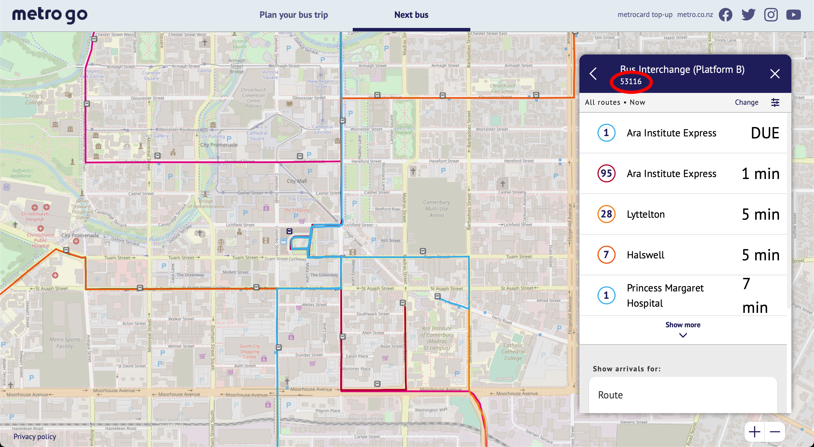
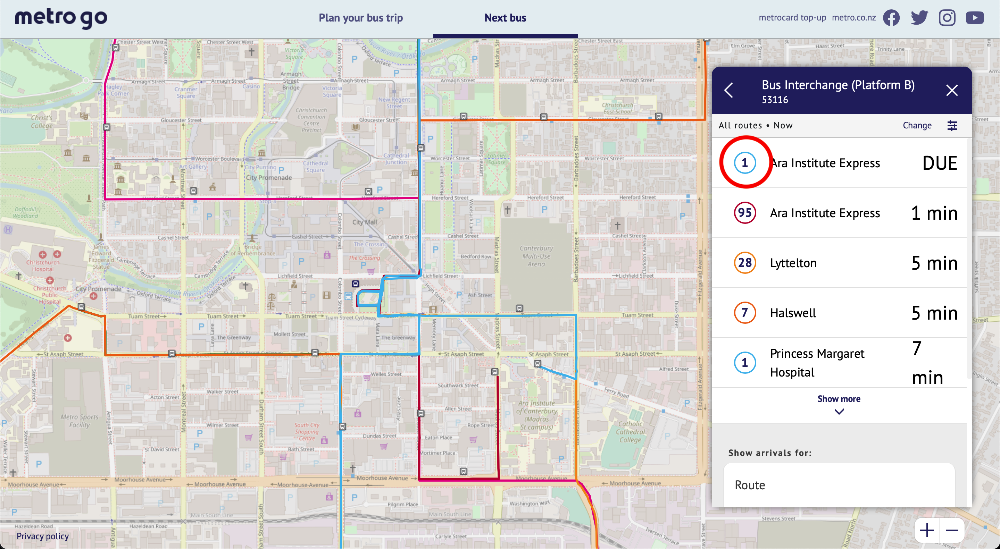

[](https://github.com/Beta-Computer/metroinfo-HA/issues?)
[](https://github.com/Beta-Computer/metroinfo-HA/network)
[](https://github.com/Beta-Computer/metroinfo-HA/stargazers)
[](https://github.com/Beta-Computer/metroinfo-HA/blob/main/LICENSE)
# Metroinfo-HA


<!-- vscode-markdown-toc -->
* [About](#About)
* [Preview](#Preview)
* [Setup](#Setup)
	* [Get Api Token](#GetApiToken)
	* [Edit Setup.py](#EditSetup.py)
	* [Edit Configuartion.yaml](#EditConfiguartion.yaml)
	* [Restart Home Assistant](#RestartHomeAssistant)
* [Advanced](#Advanced)
	* [Scan Interval](#ScanInterval)
	* [Icon](#Icon)
		* [Reloading Customize](#ReloadingCustomize)
		* [Restart Home assistant](#RestartHomeassistant)
* [Troubleshooting](#Troubleshooting)
	* [IndexError: list index out of range](#IndexError:listindexoutofrange)
	* [Configuration.yaml Error](#Configuration.yamlError)
	* [Other Error](#OtherError)
* [License](#License)

<!-- vscode-markdown-toc-config
	numbering=true
	autoSave=true
	/vscode-markdown-toc-config -->
<!-- /vscode-markdown-toc -->

##  1. <a name='About'></a>About

This code connects [Metroinfo Siri API](https://apidevelopers.metroinfo.co.nz/api-details#api=siri-service) to [Home assistant](https://www.home-assistant.io) using the [command line sensor intergation.](https://www.home-assistant.io/integrations/sensor.command_line/) This allows you to obtain realtime departure info for Christchurch public transport, which can then be displayed on your [Home Assistant dashboard](https://www.home-assistant.io/lovelace/) or used in [automations](https://www.home-assistant.io/docs/automation/).

If you would like to connect the metroinfo schedule (does't update in realtime) you should use [Metroinfo GTFS Static Api](https://apidevelopers.metroinfo.co.nz/api-details#api=gtfs-static-service) see [Home Assistant GTFS intergration.](https://www.home-assistant.io/integrations/gtfs/)

##  2. <a name='Preview'></a>Preview

<p class='img'>
  
  
  Preview of the time untill bus sensor.
</p>

##  3. <a name='Setup'></a>Setup

###  3.1. <a name='GetApiToken'></a>Get Api Token

1. Get your own api token from [https://apidevelopers.metroinfo.co.nz](https://apidevelopers.metroinfo.co.nz)
<p class='img'>
  
  Click on sign up.
</p>

2. Enter your details
3. Go to your email and click the link sent to you by metroinfo
4. Sign in with your email and password
5. subscribe to [real time information](https://apidevelopers.metroinfo.co.nz/product#product=real-time-information)
<p class='img'>
  
</p>
6. Name it something recognisable for example "home assistant", agree to the terms and conditions and click subscribe
<p class='img'>
  
</p>

7. Write down your api token. 
###  3.2. <a name='EditSetup.py'></a>Edit Setup.py
8. Add `metroinfo.py` and `Setup.py` to the same folder as your `configuration.yaml`. These can be found [here.](/config/)
9. Open `Setup.py` with [Visual Studio Code](https://my.home-assistant.io/redirect/supervisor_addon/?addon=a0d7b954_vscode), [File editor](https://my.home-assistant.io/redirect/supervisor_addon/?addon=core_configurator) or [Samba share](https://my.home-assistant.io/redirect/supervisor_addon/?addon=core_samba)

10. Change `apitoken` to your api token. Api token can be found [here](https://apidevelopers.metroinfo.co.nz/profile)

```python
apitoken = "paste your api token here"
```

11. Change `stopcode` to a stop found [here.](https://go.metroinfo.co.nz/) Alternatively a list of stop codes can be found [here](/metroinfo-data/stops.txt)
<p class='img'>
  
</p>

```python
apitoken = "paste your api token here"
stopcode = "53088"
```

12. Change `filterbuscode` to a stop found [here](https://go.metroinfo.co.nz/). Alternatively a list of bus route codes can be found [here](/metroinfo-data/routes.txt) 
<p class='img'>
  
</p>


13. Set `get_next_bus` to true or false 

If you want to get the next bus regardless of the next bus code you will need to set `get_next_bus` to true in `Setup.py` see example bellow.

```python
apitoken = "paste your api token here"
stopcode = "53088"
get_next_bus = "true"
```
if you would like to filter the next bus set `get_next_bus` to false in `Setup.py` see example bellow

```python
apitoken = "paste your api token here"
stopcode = "53088"
get_next_bus = "true"
```
14. Optional set the filter bus code.

If you would like to filter by a bus code for example: "29" use this in `Setup.py`
note get_next_bus must be set to false to filter.

```python
apitoken = "paste your api token here"
stopcode = "53088"
get_next_bus = "false"
filterbuscode = '29'
```

15. Set offset
offset allowes you to account for the time to travel to the bus stop. This means that a bus time of 0 will be when you need to leave to catch your bus. See example bellow

```python
apitoken = "paste your api token here"
stopcode = "53088"
get_next_bus = "false"
filterbuscode = '29'
offset = 5
```

if you would like no offset the nset `offset = 0` in `Setup.py` See example bellow

```python
apitoken = "paste your api token here"
stopcode = "53088"
get_next_bus = "false"
filterbuscode = '29'
offset = 0
```

###  3.3. <a name='EditConfiguartion.yaml'></a>Edit Configuartion.yaml
16. Open `configuration.yaml` and add this code. See [this](https://www.home-assistant.io/docs/configuration/#editing-configurationyaml) if you need help editing `configuration.yaml`. Change `/path/to/script/` to the path to your `metroinfo.py` file.
```yaml
sensor:
  - platform: command_line
    name: Time Until Next Bus
    command: "python3 /path/to/script/metroinfo.py"
    unit_of_measurement: minutes
```
###  3.4. <a name='RestartHomeAssistant'></a>Restart Home Assistant

17. [Restart Home assistant](https://www.home-assistant.io/docs/configuration/#reloading-changes) 


<a href="https://my.home-assistant.io/redirect/server_controls/" target="_blank"></a>

##  4. <a name='Advanced'></a>Advanced

###  4.1. <a name='ScanInterval'></a>Scan Interval
The [command line sensor intergation.](https://www.home-assistant.io/integrations/sensor.command_line/) supports [scan_interval](https://www.home-assistant.io/integrations/sensor.command_line/#scan_interval) which defines number of seconds for polling the metroinfo api. Defult is 60.

```yaml
  - platform: command_line
    name: Bus Time
    command: "python3 /path/to/script/metroinfo.py"
    unit_of_measurement: minutes
    scan_interval: 60
```
[Restart Home assistant](https://www.home-assistant.io/docs/configuration/#reloading-changes) 

<a href="https://my.home-assistant.io/redirect/server_controls/" target="_blank"></a>

###  4.2. <a name='Icon'></a>Icon
To update the icon you will need to add the following yaml to your home assistant `configuration.yaml` file. More information can be found [here.](https://next.home-assistant.io/docs/configuration/customizing-devices#icon)
Icons can be custom or a [meterial design icon.](https://materialdesignicons.com)

```yaml
homeassistant:
    customize:
      sensor.time_until_next_bus:
        icon: mdi:bus-stop
```

####  4.2.1. <a name='ReloadingCustomize'></a>Reloading Customize

Home Assistant offers a service to reload the core configuration while Home Assistant is running. This allows you to change your customize section and see your changes being applied without having to restart Home Assistant.

To reload customizations, navigate to Configuration > Server Controls and then press the "Reload Location & Customizations" button. If you don't see this, enable Advanced Mode on your user profile page first.

Alternatively, you can reload via service call. Navigate to Developer Tools > Services tab, select `homeassistant.reload_core_config` from the dropdown and press the "Call Service" button.

####  4.2.2. <a name='RestartHomeassistant'></a>Restart Home assistant
Alternativly you can restart your entire home assistant instance.

[Restart Home assistant](https://www.home-assistant.io/docs/configuration/#reloading-changes) 

<a href="https://my.home-assistant.io/redirect/server_controls/" target="_blank"></a>

##  5. <a name='Troubleshooting'></a>Troubleshooting
###  5.1. <a name='IndexError:listindexoutofrange'></a>IndexError: list index out of range
  
  - Make sure filter bus code is a string for example `filterbuscode = '5'`
  - You may get this error if a bus is not scheduled at this stop.

###  5.2. <a name='Configuration.yamlError'></a>Configuration.yaml Error

  - if you have split your `configuration.yaml` you will need to place the `configuration.yaml` code above into your `sensor.yaml` file and you will need to use the code bellow.

```yaml
- platform: command_line
  name: Bus Time
  command: "python3 /path/to/script/metroinfo.py"
  unit_of_measurement: minutes
```
###  5.4. <a name='OtherError'></a>Other Error
  - [Open a issue](https://github.com/Beta-Computer/metroinfo-HA/issues/new/choose)
##  6. <a name='License'></a>License
Metroinfo-HA is licensed under the [MIT License](https://github.com/Beta-Computer/metroinfo-HA/blob/main/LICENSE)
