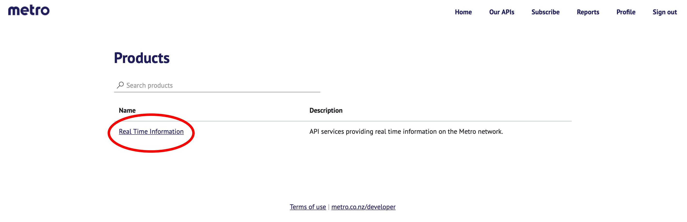
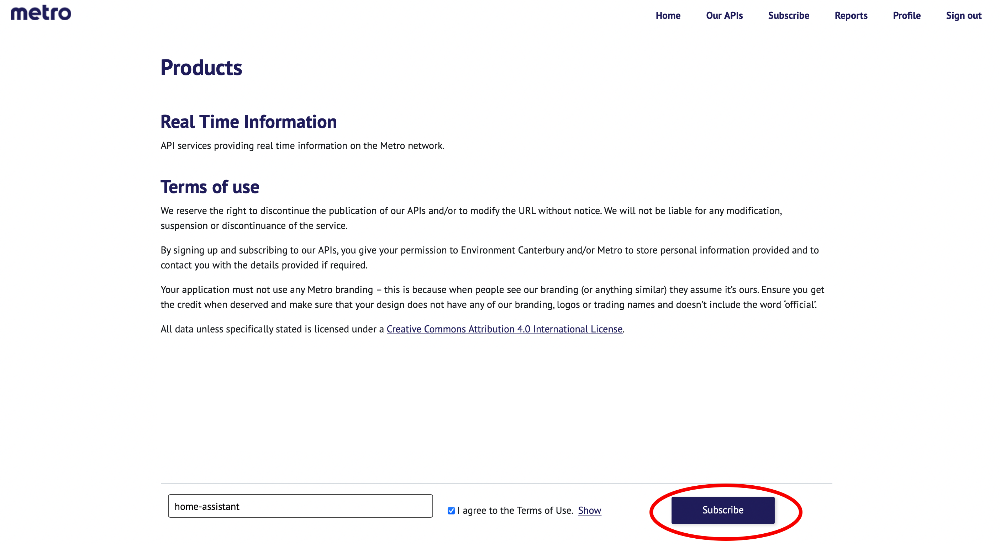

# Metroinfo-HA
Connect Metroinfo api to Home assistant using the [command line sensor intergation.](https://www.home-assistant.io/integrations/sensor.command_line/)

## Setup
### Get Api Token

1. Get your own api token from [https://apidevelopers.metroinfo.co.nz](https://apidevelopers.metroinfo.co.nz)
<p class='img'>
  
  Click on sign up.
</p>

2. Enter your details
3. Go to your email and click the link sent to you by metroinfo
4. Sign in with your email and password
5. subscribe to [real time information](https://apidevelopers.metroinfo.co.nz/product#product=real-time-information)
<p class='img'>
  
</p>
6. Name it something recognisable for example "home assistant", agree to the terms and conditions and click subscribe
<p class='img'>
  
</p>

7. Write down your api token. 
### Edit Setup.py
8. Add `metroinfo.py` and `Setup.py` to the same folder as your `configuration.yaml`. These can be found [here.](/config/)
9. Open `Setup.py` with [Visual Studio Code](https://my.home-assistant.io/redirect/supervisor_addon/?addon=a0d7b954_vscode), [File editor](https://my.home-assistant.io/redirect/supervisor_addon/?addon=core_configurator) or [Samba share](https://my.home-assistant.io/redirect/supervisor_addon/?addon=core_samba)

10. Change `apitoken` to your api token. Api token can be found [here](https://apidevelopers.metroinfo.co.nz/profile)
11. Change `stopcode` to a stop found [here.](https://go.metroinfo.co.nz/) List of stop codes can be found [here](/metroinfo-data/stops.txt)
12. Change `filterbuscode`. list of bus route codes can be found [here](/metroinfo-data/routes.txt)

If you want to get the next bus regardless of the next bus code you will need to set `get_next_bus` to true in `Setup.py` see example bellow.

```python
apitoken = "paste your api token here"
stopcode = "53088"
get_next_bus = "true"
```
If you would like to filter by a bus code for example: "29" use this in `Setup.py`
```python
apitoken = "paste your api token here"
stopcode = "53088"
filterbuscode = '29'
get_next_bus = "false"
```
### Edit Configuartion.yaml
13. Open `configuration.yaml` and add this code. See [this](https://www.home-assistant.io/docs/configuration/#editing-configurationyaml) if you need help editing `configuration.yaml`. Change `/path/to/script/` to the path to your `metroinfo.py` file.
```yaml
sensor:
  - platform: command_line
    name: Bus Time
    command: "python3 /path/to/script/metroinfo.py"
    unit_of_measurement: minutes
```
### Restart Home Assistant

14. [Restart Home assistant](https://www.home-assistant.io/docs/configuration/#reloading-changes) 


<a href="https://my.home-assistant.io/redirect/server_controls/" target="_blank"></a>

## Advanced

The [command line sensor intergation.](https://www.home-assistant.io/integrations/sensor.command_line/) supports scan_interval which defines number of seconds for polling the metroinfo api. Defult is 60.

```yaml
  - platform: command_line
    name: Bus Time
    command: "python3 /path/to/script/metroinfo.py"
    unit_of_measurement: minutes
    scan_interval: 60
```

## Troubleshooting
### IndexError: list index out of range
  
  - Make sure filter bus code is a string for example `filterbuscode = '5'` or set `filterbuscode = 0` if you would like to get the next bus regartless of code.
  - You may get this error if a bus is not scheduled at this stop.

### Configuration.yaml Error

  - if you have split your `configuration.yaml` you will need to place the `configuration.yaml` code above into your `sensor.yaml` file and you will need to use the code bellow.

```yaml
- platform: command_line
  name: Bus Time
  command: "python3 /path/to/script/metroinfo.py"
  unit_of_measurement: minutes
```
### Other Error
  - [Open a issue](https://github.com/Beta-Computer/metroinfo-HA/issues/new/choose)
